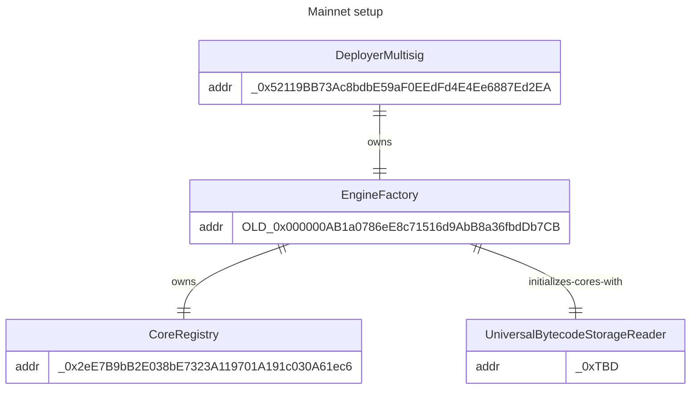
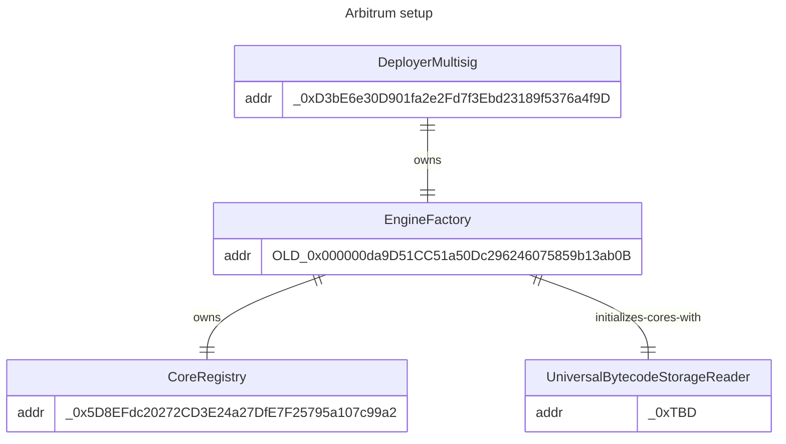
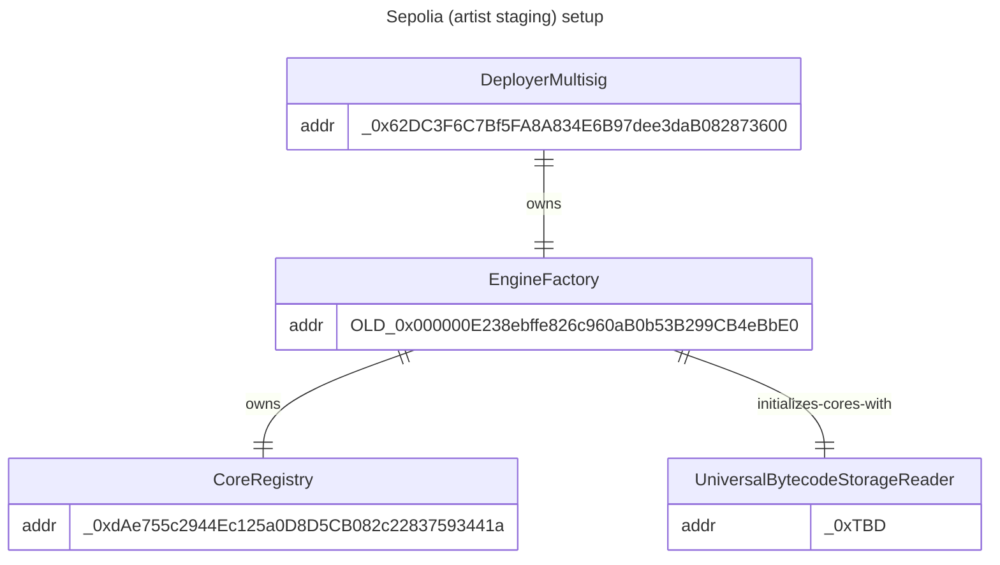
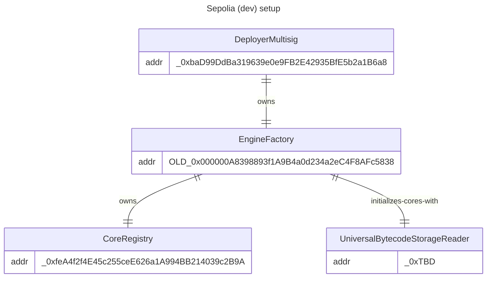

# Infrastructure Documentation

## Overview

Art Blocks has deployed infrastructure on different networks that support our smart contracts

## Unpermissioned deployments (all networks, latest)

The following contracts are deployed to all Art Blocks supported networks and are not permissioned. They also may be safely deployed by any wallet on any network, thanks to the use of the [keyless create2 factory system of contracts](./README.md#keyless-create2-factory).

| Contract/Library                                     | Address                                      |
| ---------------------------------------------------- | -------------------------------------------- |
| Library: BytecodeStorageV2:BytecodeStorageReader     | `0x000000000016A5A5ff2FA7799C4BEe89bA59B74e` |
| BytecodeStorageReaderContractV2                      | `0xTBD`                                      |
| V3FlexLib (used v3.2.4 - current)                    | `0xNEW`                                      |
| SplitProviderV0                                      | `0x0000000004B100B47f061968a387c82702AFe946` |
| Implementation: GenArt721CoreV3_Engine (v3.2.4)      | `0xNEW`                                      |
| Implementation: GenArt721CoreV3_Engine_Flex (v3.2.5) | `0xNEW`                                      |

## Permissioned deployments

The following diagrams show the deployment of permissioned infrastructure contracts on Art Blocks supported networks. These contracts are permissioned to be deployed by specific wallets and are used to deploy and index the core contracts.

_Note: these are the most recent set of deployments, and the addresses may change in the future._

### Mainnet

### Arbitrum

### Sepolia (artist staging)

### Sepolia (dev)

## Unpermissioned deployments, deprecated (all networks)

The following contracts were deployed to all Art Blocks supported networks and are not permissioned, but have been deprecated in favor of more recent versions.

They are included here for reference purposes.

| Contract/Library                                     | Address                                      |
| ---------------------------------------------------- | -------------------------------------------- |
| V3FlexLib (used v3.2.0 - v3.2.2)                     | `0x0000000006FD94B22fb33164322019750E854f96` |
| Implementation: GenArt721CoreV3_Engine (v3.2.2)      | `0x000000F74f006CE6480042f001c45c928D1Ae6E7` |
| Implementation: GenArt721CoreV3_Engine_Flex (v3.2.3) | `0x0066009B13b8DfDabbE07800ee00004b008257D9` |
| Implementation: GenArt721CoreV3_Engine (v3.2.0)      | `0x00000000AEf91971cc6251936Ec6568B23b55342` |
| Implementation: GenArt721CoreV3_Engine_Flex (v3.2.1) | `0x00000000af817dFBc2b3006E365D2eFef1953334` |

## Permissioned deployments, deprecated (all networks)

The following contracts were deployed by Art Blocks on various production networks and were permissioned, but have been deprecated in favor of more recent updates.

They are included here for reference purposes.

| Contract/Library (network:Contract) | Address                                      |
| ----------------------------------- | -------------------------------------------- |
| mainnet:EngineFactory (1)           | `0x000000AB1a0786eE8c71516d9AbB8a36fbdDb7CB` |
| arbitrum:EngineFactory (1)          | `0x000000da9D51CC51a50Dc296246075859b13ab0B` |
| mainnet:EngineFactory (0)           | `0x00000000F82E4e6D5AB22D63050FCb2bF15eE95d` |
| arbitrum:EngineFactory (0)          | `0x000000bbAA3E36b60C06A92430D8956459c2Fd51` |
