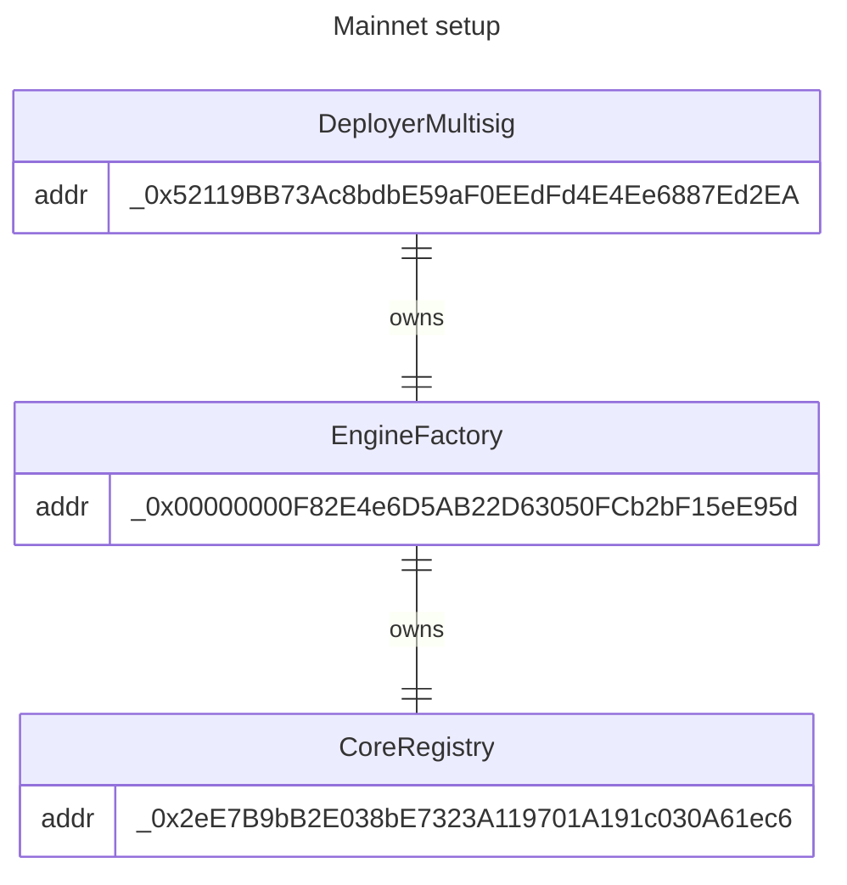
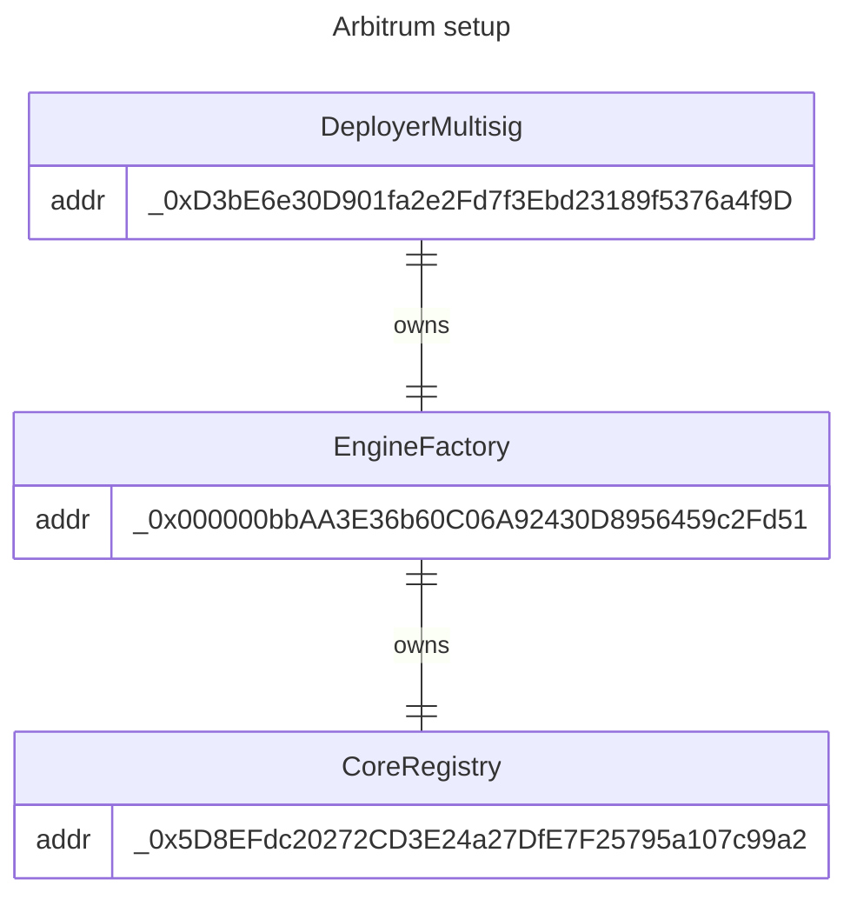
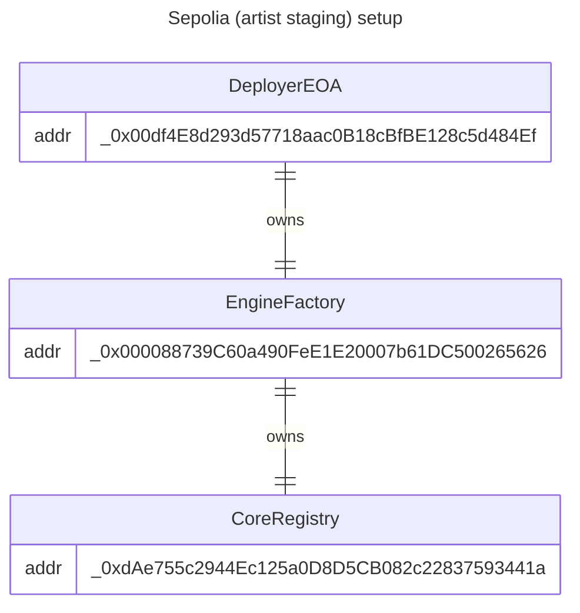
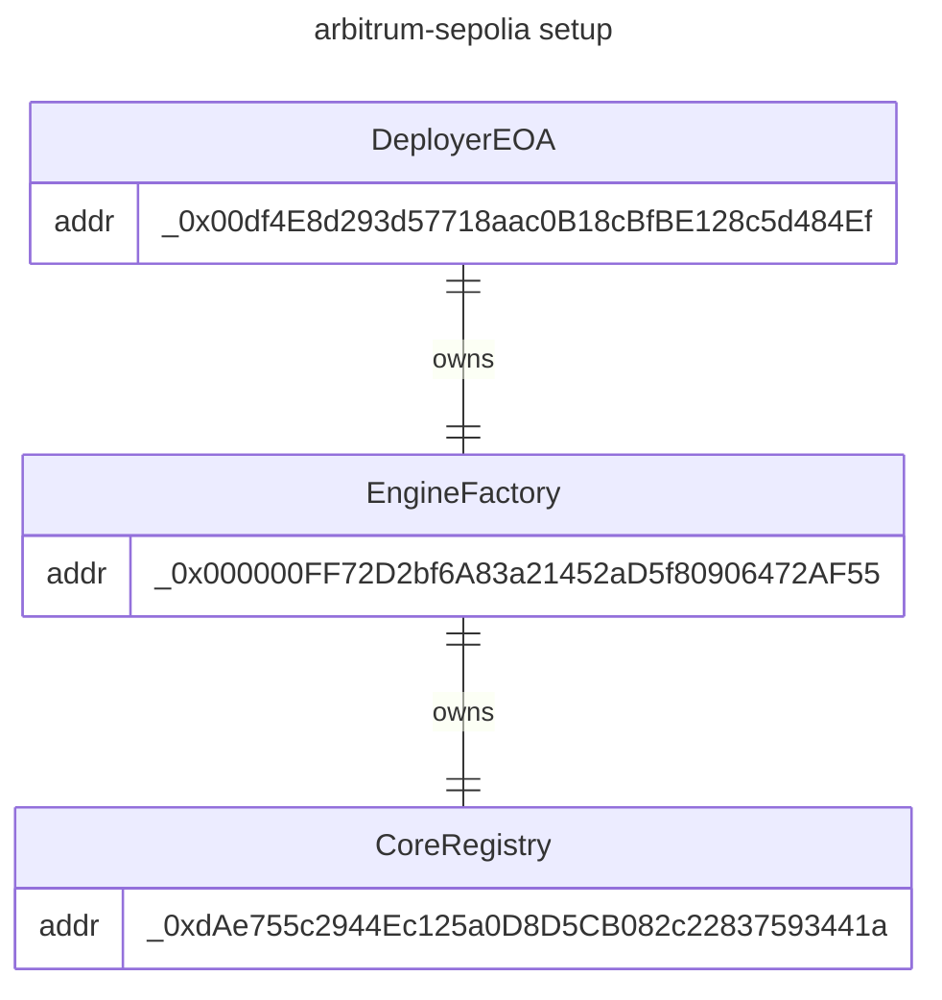
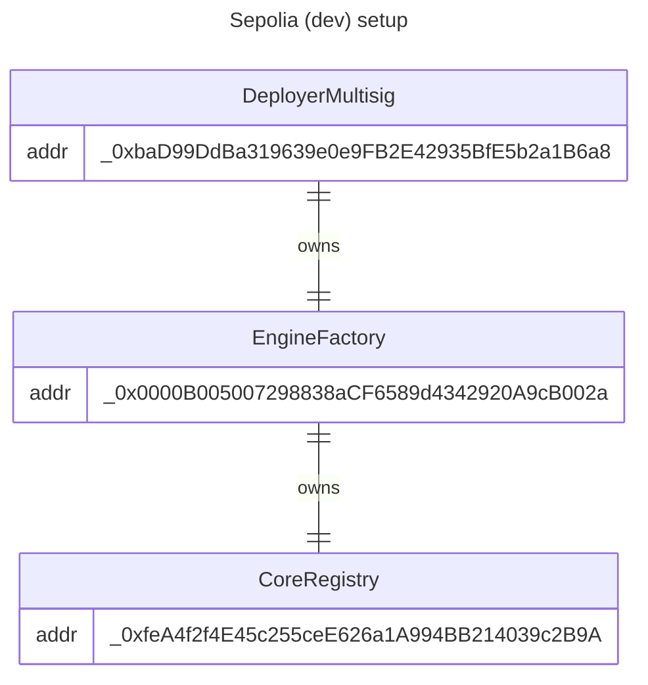

# Infrastructure Documentation

## Overview

Art Blocks has deployed infrastructure on different networks that support our smart contracts

## Unpermissioned deployments (all networks)

The following contracts are deployed to all Art Blocks supported networks and are not permissioned. They also may be safely deployed by any wallet on any network, thanks to the use of the [keyless create2 factory system of contracts](./README.md#keyless-create2-factory).

Below is a table of the shared minter filter contracts that are deployed on mainnet and testnets. Note that each of these contracts has a function available to enumerate all globally approved minter contracts, `getAllGloballyApprovedMinters()`

| Contract/Library                                     | Address                                      |
| ---------------------------------------------------- | -------------------------------------------- |
| BytecodeStorageV2:BytecodeStorageReader              | `0x000000000016A5A5ff2FA7799C4BEe89bA59B74e` |
| V3FlexLib                                            | `0x0000000006FD94B22fb33164322019750E854f96` |
| SplitProviderV0                                      | `0x0000000004B100B47f061968a387c82702AFe946` |
| Implementation: GenArt721CoreV3_Engine (v3.2.0)      | `0x00000000AEf91971cc6251936Ec6568B23b55342` |
| Implementation: GenArt721CoreV3_Engine_Flex (v3.2.1) | `0x00000000af817dFBc2b3006E365D2eFef1953334` |

## Permissioned deployments

The following diagrams show the deployment of permissioned core-contract-related contracts on Art Blocks supported networks. These contracts are permissioned to be deployed by specific wallets and are used to deploy and index the core contracts.

_Note: these are the most recent set of deployments, and the addresses may change in the future._

### Mainnet

### Arbitrum

### Sepolia (artist staging)

### Arbitrum-Sepolia

### Sepolia (dev)

