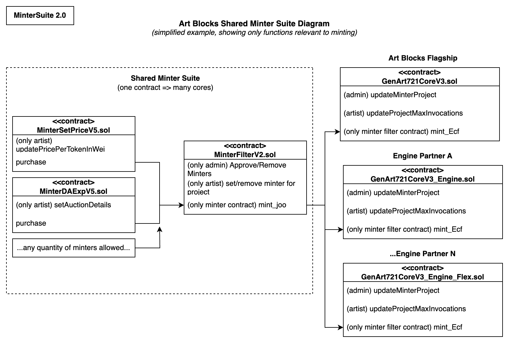

# Minter Suite Documentation

## Overview

The Art Blocks Minter Suite is a collection of smart contracts that enable Artists using V3 core contracts to distribute tokens from their projects to collectors.

A diagram of the the Minter Suite is shown below:

> note: The diagram above describes the Art Blocks Shared Minter Suite. The previous version of the non-shared minter suite is not shown.

## MinterFilter Suite Compatibility Chart

The following table shows which Minters and MinterFilters are compatible with different Art Blocks and Art Blocks Engine Core contracts.

| Core Contract Version                          | Minter Filter  | Recommended Minters                                                                                                                                        |
| :--------------------------------------------- | :------------- | :--------------------------------------------------------------------------------------------------------------------------------------------------------- |
| V1, V1_PRTNR                                   | MinterFilterV0 | MinterSetPriceV1 MinterSetPriceERC20V1 MinterDAExpV1 MinterDALinV1 MinterMerkleV0 MinterHolderV0                                            |
| V2 (PBAB)                                      | -              | (various PBAB minters)                                                                                                                                     |
| V3, V3_Explorations, V3_Engine, V3_Engine_Flex | MinterFilterV2 | MinterSetPriceV5 MinterSetPriceERC20V5 MinterSetPriceMerkleV5 MinterSetPriceHolderV4 MinterDALinV5 MinterDAExpV5 MinterDAExpSettlementV3 |
| V3_Engine, V3_Engine_Flex                      | MinterFilterV2 | MinterSetPricePolyptychV5                                                                                                                                  |

> note: MinterFilterV1 is also compatible with V3 core contracts, but it is recommended to migrate to MinterFilterV2 to enable additional functionality and indexing.

## Flagship

### Active Flagship Minting Contract(s)

These are the smart contracts that receive funds, and split them between the artist(s) and the platform. Artists receive funds directly from these contracts.

#### MinterSetPrice (Set Price)

- V0 (deprecated): [0x1DEC9E52f1320F7Deb29cBCd7B7d67f3dF785142](https://etherscan.io/address/0x1DEC9E52f1320F7Deb29cBCd7B7d67f3dF785142#code)
- V5: TBD

#### MinterSetPriceERC20 (Set Price with ERC20)

- V0 (deprecated): [0x48742D38a0809135EFd643c1150BfC13768C3907](https://etherscan.io/address/0x48742D38a0809135EFd643c1150BfC13768C3907#code)
- V5: TBD

#### MinterDALin (Linear Dutch Auction)

- V0 (deprecated): [0xd219f61Bb5A3ffDeCB4362610977F1dAB3930eE2](https://etherscan.io/address/0xd219f61Bb5A3ffDeCB4362610977F1dAB3930eE2#code)
- V5: TBD

#### MinterDAExp (Exponential Decay Dutch Auction)

- V0 (deprecated): [0xFc74fD0f2c7EaD04f1E5E9fd82Aef55620710D7C](https://etherscan.io/address/0xFc74fD0f2c7EaD04f1E5E9fd82Aef55620710D7C#code)
- V5: TBD

#### MinterDAExpSettlement (Expotential Decay Last Price Dutch Auction)

- V2: TBD

#### MinterMerkle (Address Allowlist)

- V5: TBD

#### Minter Holder (Token Holder)

- V5: TBD

### Other Flagship Minter Contracts

Legacy minting contract for flagship V0 core: [0x47e312d99c09ce61a866c83cbbbbed5a4b9d33e7](https://etherscan.io/address/0x47e312d99c09ce61a866c83cbbbbed5a4b9d33e7).

MinterFilterV0 for flagship V1 core: [0x4aafCE293b9B0faD169c78049A81e400f518E199](https://etherscan.io/address/0x4aafCE293b9B0faD169c78049A81e400f518E199#code).

MinterFilterV2 for flagship V3 core: TBD

## Art Blocks Engine

### Engine Minter Contracts

We encourage our Engine partners with V3 core contracts to migrate to use the shared minter suite, which uses the same minters as the Art Blocks flagship contract. However, some partners may choose to continue to use their existing minters or custom minters outside of the shared minter suite. In that case, see the minters included in each partner's deployment details in the `/deployments/engine/[V2|V3]/<engine-partner>/` directories.
