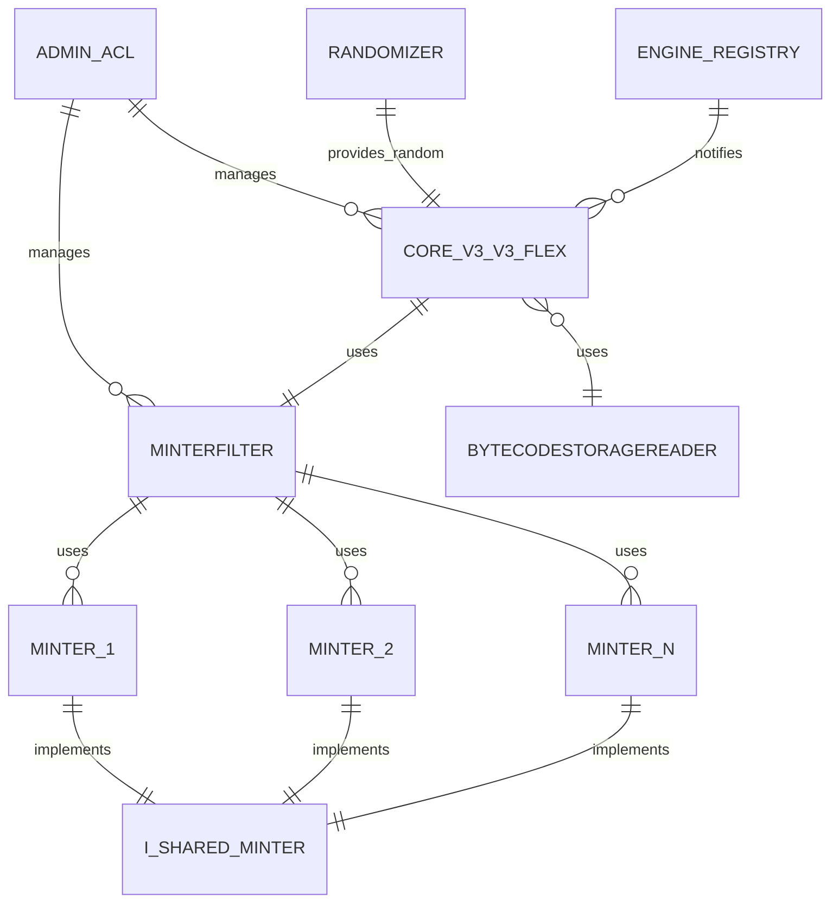

# Art Blocks Smart Contracts

[](https://dl.circleci.com/status-badge/redirect/gh/ArtBlocks/artblocks-contracts/tree/main)

[](https://www.gitpoap.io/gh/ArtBlocks/artblocks-contracts)
[](https://coveralls.io/github/ArtBlocks/artblocks-contracts?branch=main)

A collection of smart contracts used by [Art Blocks](https://artblocks.io) for our flagship product, as well as Artblocks Engine products.

This repository is actively used and maintained by the Art Blocks team. We welcome contributions from the community. Please see our [Contributing](#contributing) section more information.

# Initial Setup

### install packages

`yarn`

### set up your environment

Create a `.env` file by duplicating `.env.example` and populating all variables.

### compile

`yarn compile`

### run the tests

`yarn test`

### generate coverage report

`yarn coverage`

### generate docs

`yarn docgen`

(docs for `main` are served at https://artblocks.github.io/artblocks-contracts/#/)

### format your source code

`yarn format`

## Contributing & Design Guidelines

We welcome contributions from the community!

Please read through our [Style Guidelines](./GUIDELINES.md), [Solidity Gotchas](./solidity-gotchas.md), and [Testing Philosophy](./test/README.md) sections before contributing.

In addition to meeting our style guidelines, all code must pass all tests and be formatted with prettier before being merged into the main branch. To run the tests, run `yarn test`. To format the code, run `yarn format`.

# Documentation

## auto-generated contract docs (via NatSpec)

Documentation for contracts is deployed via GitHub pages at: https://artblocks.github.io/artblocks-contracts/

Documentation for contracts may also be generated via `yarn docgen`. Most Art Blocks contracts use [NatSpec](https://docs.soliditylang.org/en/v0.8.9/natspec-format.html#documentation-example) comments to automatically enrich generated documentation. Some contracts use [dynamic expressions](https://docs.soliditylang.org/en/v0.8.9/natspec-format.html#dynamic-expressions) to improve user experience.

## Art Blocks V3 Contract Architecture

For a high-level overview of the Art Blocks V3 contract architecture, refer to the simplified entity relationship diagram below.



For a more detailed overview of this architecture, please see the [V3 Contract Architecture page](./V3_ARCHITECTURE.md).

## Minter Suite

Art Blocks has developed a shared Minter Suite that can be used to mint tokens. The Minter Suite is designed to be highly flexible, and can be used to mint tokens in a variety of ways on any V3 Flagship or Art Blocks Engine contract.

A legacy, non-shared minter suite is also currently used by many partners, and is still in use by many partners during migration to the shared minter suite.

For details on the Art Blocks Minter Suite, see the [minter suite documentation](./MINTER_SUITE.md).

# Deployments

## Deploying New Contracts

Art Blocks deploys contracts a variety of ways, depending on the contract or library and its intended use. In general, we use Hardhat for deployments and verification, and have a variety of deployment scripts that can be used to deploy contracts to various networks. Additionally, at times we may use a keyless create2 factory to deploy standard infrastructure contracts to enable permissionless deployments of infrastructure on any network that supports pre-EIP-155 transactions.

A summary of our deployed infrastructure is available on our [Infrastructure Documentation](./INFRASTRUCTURE.md).

### Keyless Create2 Factory

We use the following keyless create2 factory to deploy standard infrastructure contracts to enable permissionless deployments of infrastructure on any network that supports pre-EIP-155 transactions.

Contracts that are deployed using the keyless create2 factory include the `BytecodeStorageReader` and `V3FlexLib` external library contracts.

<table>
    <tr>
        <td>Name</td>
        <td>Address</td>
    </tr>
    <tr>
        <td>KEYLESS_CREATE2_DEPLOYER_ADDRESS</td>
        <td>0x4c8D290a1B368ac4728d83a9e8321fC3af2b39b1</td>
    </tr>
    <tr>
        <td>KEYLESS_CREATE2_ADDRESS</td>
        <td>0x7A0D94F55792C434d74a40883C6ed8545E406D12</td>
    </tr>
    <tr>
        <td>INEFFICIENT_IMMUTABLE_CREATE2_FACTORY_ADDRESS</td>
        <td>0xcfA3A7637547094fF06246817a35B8333C315196</td>
    </tr>
    <tr>
        <td>IMMUTABLE_CREATE2_FACTORY_ADDRESS</td>
        <td>0x0000000000ffe8b47b3e2130213b802212439497</td>
    </tr>
</table>

If you are interested in deploying the create2 factory contracts on a new network, please reference the documentation here: https://github.com/ProjectOpenSea/seaport/blob/main/docs/Deployment.md#setting-up-factory-on-a-new-chain

### Hardhat Scripts

> IMPORTANT - many scripts rely on typechain-generated factories, so ensure you have run `yarn generate:typechain` before running any deployment scripts.

We have two types of deployment scripts: Generic and Specific. In general, most new deployments now use generic scripts.

Generic deployment scripts are located in the `./scripts` directory. These scripts are used to deploy contracts that are not specific to a particular deployment. Generic deployment scripts are used to deploy contracts that are used by multiple partners or core contracts, such as the `Art Blocks Engine` contracts, or minters. Generic scripts take an input json file, located in the `/deployents/` directory, and execute the deployment as defined in the input file. In general, there are scripts prepared to run generic deployments for all networks and environments. For example, the following can be used to deploy the `Art Blocks Engine` contracts to the `goerli` test network (note that an input configuration is also required for all generic deployments.):

```bash
yarn deploy:dev:v3-engine
```

Specific deployments are used less frequently, and are located in the `/scripts` directory as well. These scripts are used to deploy contracts that are specific to a particular deployment. They are not easily reusable, and are generally only used once. An example to run a specific deployment is:

```bash
yarn hardhat run --network <your-network> scripts/deploy.ts
```

where `<your network>` is any network configured in `hardhat.config.js`.

For additional deployment details, see hardhat docs: [https://hardhat.org/guides/deploying.html](https://hardhat.org/guides/deploying.html)

## Deployed Contract Details

### Core Contract Versions

This is the Smart contract that controls the artwork created by the artist. No financial transactions occur on this Smart contract.

Core contracts use the versioning schema below:

|        Description        |          Version          | Project Range | Mainnet Address                                                                                                                                                                                                  |
| :-----------------------: | :-----------------------: | :-----------: | :--------------------------------------------------------------------------------------------------------------------------------------------------------------------------------------------------------------- |
|        AB Core V0         |            V0             |      0-2      | `0x059EDD72Cd353dF5106D2B9cC5ab83a52287aC3a`                                                                                                                                                                     |
|        AB Core V1         |            V1             |     3-373     | `0xa7d8d9ef8D8Ce8992Df33D8b8CF4Aebabd5bD270`                                                                                                                                                                     |
|     Engine Cores (V2)     |          V2_PBAB          | All V2 Engine | Various - see `deployments/engine/` directory [DEPLOYMENTS.md files](https://github.com/search?q=repo%3Aartblocks%2Fartblocks-contracts+path%3A*.md+path%3A**%2FDEPLOYMENTS.md&type=Code&ref=advsearch&l=&l=)    |
| Engine Partner Cores (V2) |         V2_PRTNR          | All V2 PRTNR  | Various - see `deployments/engine/` directory [DEPLOYMENTS.md files](https://github.com/search?q=repo%3Aartblocks%2Fartblocks-contracts+path%3A*.md+path%3A**%2FDEPLOYMENTS.md&type=Code&ref=advsearch&l=&l=)    |
|   AB Core V3 (current)    |            V3             |     374+      | `0x99a9B7c1116f9ceEB1652de04d5969CcE509B069`                                                                                                                                                                     |
| Engine_V3, Engine_V3_Flex | Engine_V3, Engine_V3_Flex | All V3 Engine | Various - see `deployments/engine/V3/` directory [DEPLOYMENTS.md](https://github.com/search?q=repo%3Aartblocks%2Fartblocks-contracts+path%3A*.md+path%3A**%2FDEPLOYMENTS.md&type=Code&ref=advsearch&l=&l=) files |

> AB Core V3 [changelog here](./contracts/V3_CHANGELOG.md), and [performance metrics here](./contracts/V3_PERFORMANCE.md).

### Testnet Contracts

The following represents the current set of flagship core contracts deployed on the Goerli testnet, and their active Minter Filters:

- Art Blocks Artist Staging (Goerli):

  - V1 Core (deprecated): https://goerli.etherscan.io/address/0xDa62f67BE7194775A75BE91CBF9FEeDcC5776D4b
  - V3 Core: https://goerli.etherscan.io/address/0xB614C578062a62714c927CD8193F0b8Bfb90055C

- Art Blocks Dev (Goerli):
  - V1 Core (deprecated): https://goerli.etherscan.io/address/0x1Bf03F29c4FEFFFe4eE26704aaA31d85c026aCE6
  - V3 Core: https://goerli.etherscan.io/address/0xF396C180bb2f92EE28535D23F5224A5b9425ceca

## Art Blocks Engine Core Contracts

For deployed core contracts, see the deployment details in the `/deployments/engine/[V2|V3]/<engine-partner>/` directories. For V2 core contracts, archived source code is available in the `/posterity/engine/` directory.

## BytecodeStorageReader

BytecodeStorageReader (currently on V1 version) is public library for reading from storage contracts. This library is intended to be deployed as a standalone contract, and provides all _read_ functionality by being used as an externally linked library within the Art Blocks ecosystem contracts that use contract storage for writes.

Given that it is an externally linked library with a shared public deployment, the deployment addresses for these shared deployments are referenced in our shared deployments `constants.ts` util (in the `BYTECODE_STORAGE_READER_LIBRARY_ADDRESSES` constant) so that they may be linked at time of deployment and are also linked here below for shared reference:

- V1 `BytecodeStorageReader` (goerli): https://goerli.etherscan.io/address/0xB8B806A10d16cc80dB788552B54B3ECb4A2A3C3D#code
- V1 `BytecodeStorageReader` (sepolia): https://sepolia.etherscan.io/address/0x7497909537cE00fDda93c12d5083D8647C593c67#code
- V1 `BytecodeStorageReader` (mainnet): https://etherscan.io/address/0xf0585dF582A0ad119F1616FB82f3b449a98EeCd5#code
- V1 `BytecodeStorageReader` (arbitrum-goerli): https://goerli.arbiscan.io/address/0x681861cD4fC92d70aE57745385065ef862954662#code
- V1 `BytecodeStorageReader` (arbitrum): https://arbiscan.io/address/0xa07f47c30C262adcC263A4D44595972c50e04db7#code
- V1 `BytecodeStorageReader` (arbitrum-sepolia): https://sepolia.arbiscan.io/address/0xb219C04128c9749b597c35D416b9988bEa9E1114#code

## Shared Randomizers

Art Blocks has developed a shared Randomizer contract that is used to generate pseudo-random numbers for all Art Blocks Engine V3 tokens. The Randomizer contract is designed to handle all globally approved shared minters, including minters that may assign token hashes directly such as the Polyptych minter.

Note that this is an area of active development, and legacy randomizer contracts will continue to be used by many contracts as they migrate to the shared randomizer and shared minter suite. Previous versions of the Randomizer contract are recorded on each V3 core contract itself, able to be queried via the `getHistoricalRandomizerAt()` function.

The most recent version of the Shared Randomizer contract is deployed at the following addresses:

- Mainnet: `0x13178A7a8A1A9460dBE39f7eCcEbD91B31752b91`
- Goerli Staging: `0xC91CFC2062D8B4Ff53A7c8836CAEf925a7C78c81`
- Arbitrum One: `0x6a5976391E708fBf918c3786cd1FcbB88732fbc1`
- Arbitrum Sepolia: `0x28f2D3805652FB5d359486dFfb7D08320D403240`

## DependencyRegistry

The DependencyRegistry is an upgradeable contract that manages the dependencies for projects on the Art Blocks platform. It maintains a registry of dependencies, licenses, supported core contracts, and project dependency overrides.

Each dependency is identified by a unique name and version (in the format "name@version"), and is associated with a specific license type (e.g., MIT, GPL). The DependencyRegistry also stores additional information for each dependency, such as the preferred Content Delivery Network (CDN), repository, and website.

The contract allows for the overriding of project dependencies. This means that specific projects can use different versions of dependencies than what's stored on the core contract. The override is defined by the address of the core contract, the project ID, and the bytes32 representation of the dependency name and version.

- `DependencyRegistry` (sepolia dev):
  - TransparentUpgradeableProxy https://sepolia.etherscan.io/address/0x5Fcc415BCFb164C5F826B5305274749BeB684e9b#code
  - V0 Implementation https://sepolia.etherscan.io/address/0x2B0EaC9FBdD487e09f3326BB616EeAD72ade9876#code
- `DependencyRegistry` (sepolia staging):
  - TransparentUpgradeableProxy https://sepolia.etherscan.io/address/0xEFA7Ef074A6E90a99fba8bAd4dCf337ef298387f#code
  - V0 Implementation https://sepolia.etherscan.io/address/0x2B0EaC9FBdD487e09f3326BB616EeAD72ade9876#code
- `DependencyRegistry` (mainnet)
  - TransparentUpgradeableProxy https://etherscan.io/address/0x37861f95882ACDba2cCD84F5bFc4598e2ECDDdAF#code
  - V0 Implementation https://etherscan.io/address/0x2d3f8D5c5294B7934aFBe4B901EEb5E7B48a4e97#code
  - AdminACLV0 https://etherscan.io/address/0x569cDfECFD848a02Ad3e74175a1A4a74484Ef944#code

## Splitter Factories

In some instances, splitter contracts may be used by projects to split revenue between multiple parties. For flagship, sometimes splitter contracts deployed using a factory contract are used. The factory contracts deployed for flagship are listed below:

| Network | Environment | Factory Address                            | Implementation Address                     |
| ------- | ----------- | ------------------------------------------ | ------------------------------------------ |
| Sepolia | Dev         | 0x39D9580445A3Fcf486c6AD0d06F66fe0d42230eC | 0xDaf4BB19982927aBEACd9bCd1cE070f188ddb26E |
| Sepolia | Staging     | 0xe3D5373D2dc56948737E79244C8C6C856336BF1A | 0xc673EdD8c29Fbb6462Ff48ce61803fa6d7f4d7A3 |
| Mainnet | Prod        | 0xb26aaD97B0e1d250dB131CD4133c11629EBB4ef7 | 0x853a03Ec9CCbf8203DF0C40926398B959d81AFd2 |

## Contract Source Code Verification

All mainnet deployments of contracts developed in this repository are verified on Etherscan. To protect against centralized source code verification failures (for example, if Etherscan were to disappear), the PR history of this repository may be used to determine the commit at which a given deployment was performed, and source code verification may be submitted by anyone to a different source code verification service. Deployment details are recorded in the `deployments/` directory.

# Royalties

Art Blocks supports on-chain royalty lookups for all Flagship and Engine tokens on Manifold's [Royalty Registry](https://royaltyregistry.xyz/lookup). This enables royalty revenue streams for artists and other creators.

For information about on-chain royalties, please see the [royalties documentation](./ROYALTIES.md).

# Source Code Archival

An NPM package is published that includes all contracts in the `/contracts/` directory. The `/contracts/archive/` directory contains contracts that were previously published, but are no longer actively developed, but should still be included in our published npm package. For example, the original Art Blocks core contracts are included in the `/contracts/archive/` directory so they may be actively integrated with subgraphs and frontends, even though they are no longer actively developed.

# References

## Running Gas Reports for Solidity Methods & Deployments

Your `.env` file should contain a `COINMARKETCAP_API_KEY` param in order to calculate ethereum gas costs. The key value can be found in the Engineering team's shared 1Password account. Additionally, you'll need to add the following object within the `module.exports` key in hardhat.config.ts:

```
  gasReporter: {
    currency: "USD",
    gasPrice: 100,
    enabled: true,
    coinmarketcap: process.env.COINMARKETCAP_API_KEY
  }
```

After this config is finished, you'll notice a `usd (avg)` column in the auto-generated table that's printed when you run unit tests with `yarn test`.
(note: gasPrice is a variable param that reflects the gwei/gas cost of a tx)

## Old contracts/addresses:

- **Primary Sales and Minting Contract (no longer in use) [0x059edd72cd353df5106d2b9cc5ab83a52287ac3a](https://etherscan.io/address/0x059edd72cd353df5106d2b9cc5ab83a52287ac3a)**
  - This is the original Art Blocks smart contract which had a built in minter. This contract represents only projects 0 (Chromie Squiggle), 1 (Genesis), 2 (Construction Token) and handled both control of the NFTs and the purchase transactions. This smart contract received funds and automatically split them between the artist and the platform.
- Secondary Sales Receiving and Sending Address (no longer in use) [0x8e9398907d036e904fff116132ff2be459592277](https://etherscan.io/address/0x8e9398907d036e904fff116132ff2be459592277)
  - This address received secondary market royalties from https://opensea.io until July 29th 2021. These royalties were subsequently distributed to artists directly from this address. After July 29th the secondary royalty address was changed to the current one on the first page of this doc.
- Primary Sales Minting Contracts (no longer in use) –
  - [0x091dcd914fCEB1d47423e532955d1E62d1b2dAEf](https://etherscan.io/address/0x091dcd914fCEB1d47423e532955d1E62d1b2dAEf)
  - [0x1Db80B860081AF41Bc0ceb3c877F8AcA8379F869](https://etherscan.io/address/0x1Db80B860081AF41Bc0ceb3c877F8AcA8379F869)
  - [0xAA6EBab3Bf3Ce561305bd53E4BD3B3945920B176](https://etherscan.io/address/0xAA6EBab3Bf3Ce561305bd53E4BD3B3945920B176)
  - [0x0E8BD86663e3c2418900178e96E14c51B2859957](https://etherscan.io/address/0x0E8BD86663e3c2418900178e96E14c51B2859957)
  - These are the Smart contract that received funds from primary sales and split them between the artist(s) and the platform. Artists received funds directly from this contract. These minter contracts are no longer in use.

## Other Useful References

[evm.codes](https://www.evm.codes/) - An interactive guide to EVM op-code costs.
