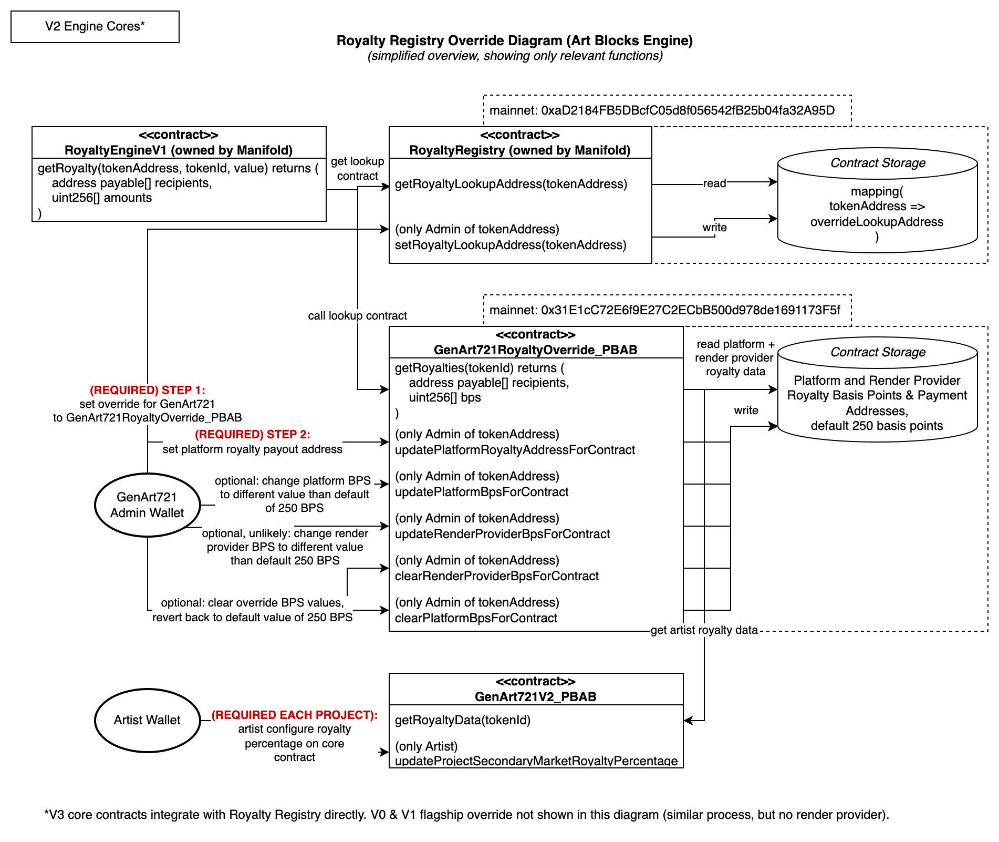

# Royalties

## Overview

Art Blocks supports on-chain royalty lookups for all Flagship and Engine tokens on Manifold's [Royalty Registry](https://royaltyregistry.xyz/lookup). This enables royalty revenue streams for artists and other creators.

## Integration with Manifold's Royalty Registry

### Configuring V3 Core Contracts

For V3 core contracts (including Art Blocks Engine V3), the contracts integrate directly with the Royalty Registry.

All that is needed to properly define on-chain royalties is for artist royalties to be set up for each project by the artist. Additionally, the platform and render provider royalty payment information should be configured for the contract.

### Configuring V2 Engine Contracts

For steps on how to configure V2 Engine contracts, please see the following section on the Art Blocks documentation site: [Configuring V2 Engine Contracts](https://docs.artblocks.io/creator-docs/art-blocks-engine-onboarding/art-blocks-engine-101/engine-royalty-registry-setup/#configuring-v2-engine-contracts)

### V2, V1, and V0 Royalty Registry override contract details

Prior to the V3 core contract, royalty registry override contracts are needed to properly integrate with the Royalty Registry. This is because these contracts were designed before the Royalty Registry was being used. These contracts delegate all permissions to the core contracts.

One important thing to note is that artist do not need to interact with the royalty registry override contracts. The artist only needs to set up royalties on the core contract. Contract administrators must initially configure the royalty registry override contracts to properly integrate with the Royalty Registry.

A diagram of Art Blocks Engine Royalty Registry override contract integration is shown below.

The following Royalty Registry override contracts are deployed at:

- **mainnet (AB deployed):**

  - AB Flagship + Partner (PRTNR) royalty override: https://etherscan.io/address/0x7b5369c24a47a72ecf932bf6974f506dde4d5eb1#code
  - Engine royalty override: https://etherscan.io/address/0x31e1cc72e6f9e27c2ecbb500d978de1691173f5f#code

- **mainnet (RR deployed):**
  - RoyaltyRegistry: https://etherscan.io/address/0xad2184fb5dbcfc05d8f056542fb25b04fa32a95d#code
  - RoyaltyEngineV1: https://etherscan.io/address/0x0385603ab55642cb4dd5de3ae9e306809991804f#code
